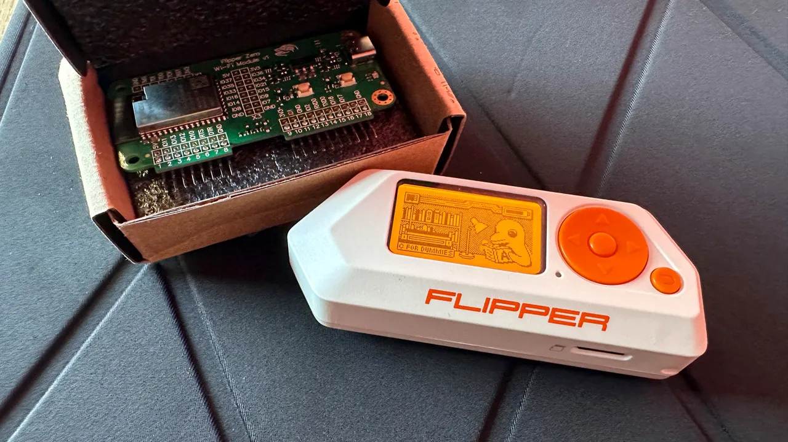
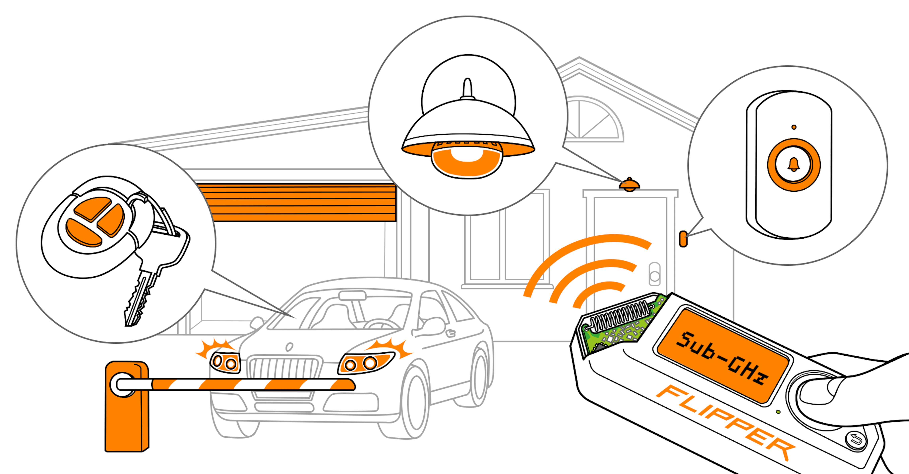
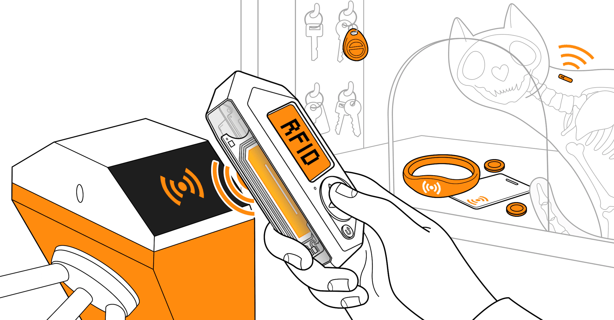
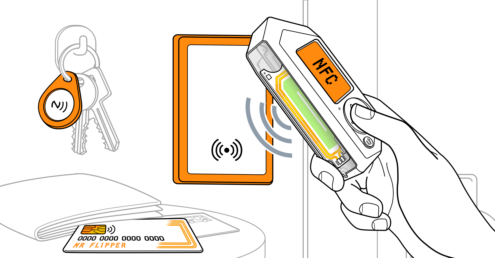
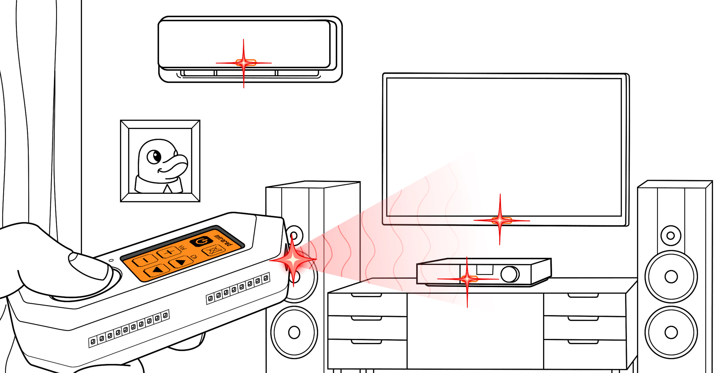
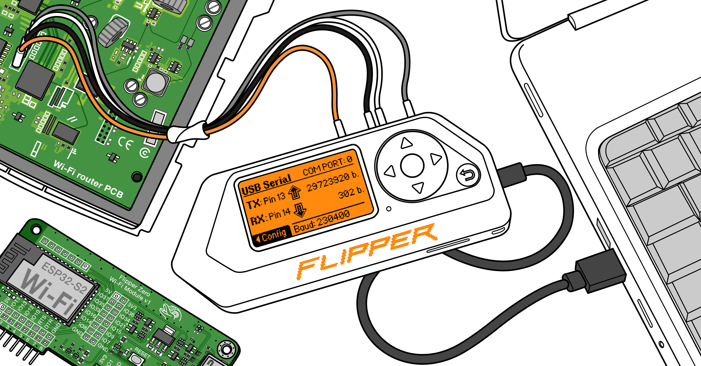
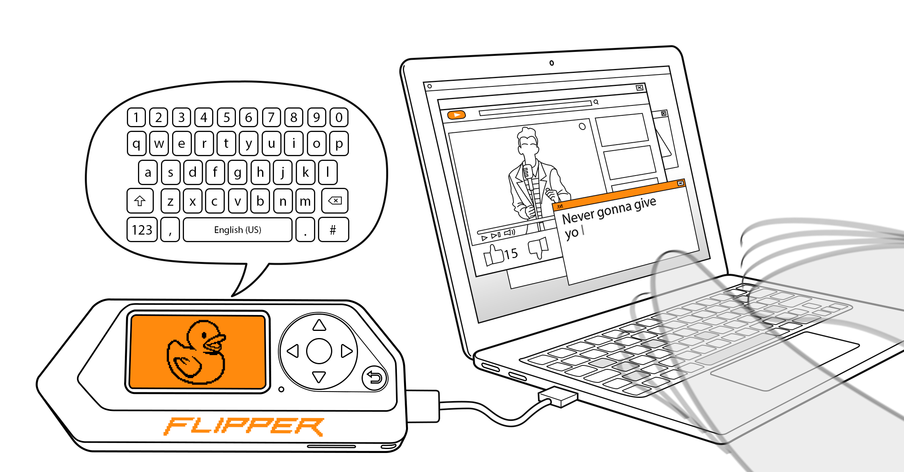
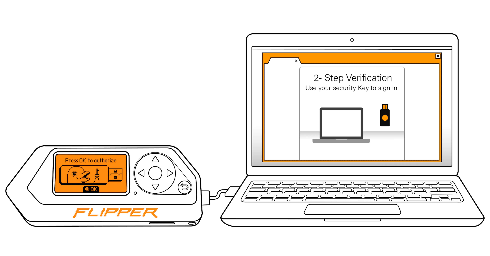
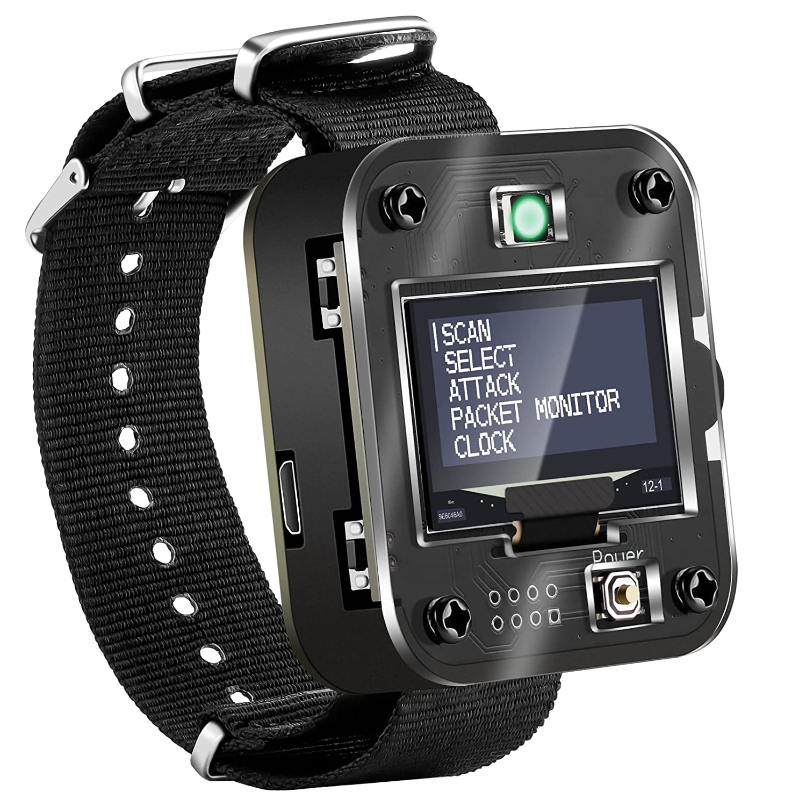
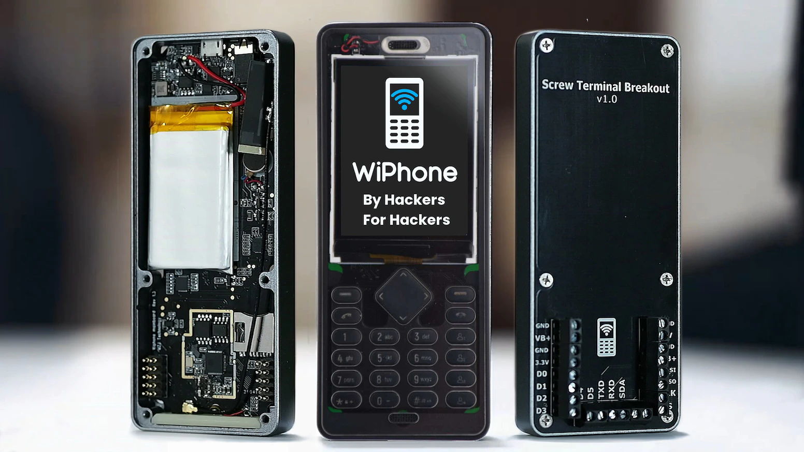

# 
 Devices that are used for hacking 

## Flipper Zero

    
<h6><i>Source: Flipper Zero: 'Can you really hack Wi-Fi networks?' and other questions answered | ZDNET. Retrieved from https://www.zdnet.com/home-and-office/flipper-zero-can-you-really-hack-wi-fi-networks-and-other-questions-answered/</i></h6>

#### Flipper Zero is easy-to-use platform for physical computing and IoT (Internet of Things) projects, It is based on the ESP32 microcontroller and has a variety of features, including Wi-Fi, Bluetooth, and a wide range of input/output (I/O) pins for connecting sensors, actuators, and other devices. The list of highlight things in Flipper Zero are :
- **Sub-Ghz**
- **125 kHz RFID**
- **NFC (Near-Field Communication)**
- **Infrared**
- **GPIO (General Purpose Input/Output)**
- **iButton**
- **Bad USB**
- **U2F (Universal 2nd Factor)**

### Sub-Ghz

    
<h6><i>Source: Flipper Zero Documentation - Flipper Zero — Documentation. Retrieved from https://docs.flipperzero.one/</i></h6>

 

#### With its built-in module that can read, store, and imitate remote controls, Flipper Zero can receive and send radio frequencies in the 300-928 MHz range. These controls interface with gates, barriers, radio locks, remote control switches, wireless doorbells, smart lighting, and other devices. Flipper Zero can assist you in determining whether or not your security is compromised.

### 125 kHz RFID

    
<h6><i>Source: Flipper Zero Documentation - Flipper Zero — Documentation. Retrieved from https://docs.flipperzero.one/</i></h6>

  

#### Low-frequency (LF) radio frequency identification (RFID) technology, which is used in access control systems, animal chips, and supply chain tracking systems. LF RFID cards, unlike NFC cards (eg: ATM card Chip), do not often provide high levels of security. This technology is available in a variety of forms, including plastic cards, key fobs, tags, wristbands, and animal microchips. The Flipper Zero includes a low-frequency RFID module that can read, save, emulate, and write LF RFID cards. 

### NFC

    
<h6><i>Source: Flipper Zero Documentation - Flipper Zero — Documentation. Retrieved from https://docs.flipperzero.one/</i></h6>

 

#### NFC technology is used in smart cards for public transportation, access cards or tags, digital business cards, and bank cards. These cards offer encryption, authentication, and full-fledged two-way data transfer via complicated protocols. The Flipper Zero has a 13.56 MHz NFC module that can read, save, and emulate NFC cards.

### Infrared

    
<h6><i>Source: Flipper Zero Documentation - Flipper Zero — Documentation. Retrieved from https://docs.flipperzero.one/</i></h6>

 

#### It can communicate with products that use infrared light to deliver commands, such as televisions, air conditioners, and multimedia systems. Flipper Zero's built-in Infrared module allows it to learn and remember infrared remotes as well as utilise its own universal remotes to control other devices.

### GPIO

    
<h6><i>Source: Flipper Zero Documentation - Flipper Zero — Documentation. Retrieved from https://docs.flipperzero.one/</i></h6>

 

#### It may be used to explore hardware, flash firmware, debug, and fuzzing. Flipper Zero can connect to hardware through its GPIO pins, operate hardware via buttons, run code, and display debug messages on the LCD screen. Flipper Zero is also a USB to UART/SPI/I2C converter.

### iButton

    
<h6><i>Source: Flipper Zero Documentation - Flipper Zero — Documentation. Retrieved from https://docs.flipperzero.one/</i></h6>

 

#### It is compatible with a 1-Wire device communication protocol, which is used in tiny electronic keys known as iButton keys. These keys are used for access control, temperature and humidity readings, cryptographic key storage, and so on. Flipper Zero cannot identify all iButton devices, even if they have the same form factor. Only access control keys may be identified by Flipper Zero. It can read, write, and emulate iButton access control keys with its built-in iButton module, which supports Dallas, Cyfral, and Metakom key protocols.

### Bad USB

    
<h6><i>Source: Flipper Zero Documentation - Flipper Zero — Documentation. Retrieved from https://docs.flipperzero.one/</i></h6>

 

#### It may function as a BadUSB device, which computers detect as a Human Interface Device (HID), such as a keyboard. A BadUSB device may modify system settings, open backdoors, extract data, launch reverse shells, and do anything else that physical access allows. It is accomplished by the execution of a series of commands written in the Rubber Ducky Scripting Language, commonly known as DuckyScript (A payload is a collection of commands).

### U2F 

    
<h6><i>Source: Flipper Zero Documentation - Flipper Zero — Documentation. Retrieved from https://docs.flipperzero.one/</i></h6>

 

#### Flipper Zero can serve as a USB universal 2nd-factor (U2F) authentication token or security key as the second authentication factor when logging into web accounts. A security key is a little gadget that aids computers in determining who you are when you sign in to an account. Using this option improves the security of your accounts.

--------

## Deauther Watch

    
<h6><i>Source: Amazon.in. Retrieved from https://www.amazon.in/Deauther-Programmable-Development-Wristband-Printing/dp/B088LPLN9V</i></h6>

#### Deauther watches are small portable devices that are designed to perform Wi-Fi deauthentication attacks. These devices are typically based on the ESP8266 or ESP32 microcontrollers and can be used to force devices connected to a Wi-Fi network to disconnect from the network. They can also be used by individuals for malicious purposes, such as disrupting Wi-Fi networks or stealing sensitive information.

- Features in Deauther Watch
- How Deauther Watch used in Penetration Testing
- Attacks that can be performed 
- Materials and Parts required to recreate the watch

### Features in Deauther Watch
- **Wi-Fi Deauthentication:** This is the primary feature of the device. It allows users to send deauthentication frames to disconnect devices from a Wi-Fi network.

- **Wi-Fi Scanning:** The device can scan nearby Wi-Fi networks and display information about them, such as SSID, channel, encryption type, and signal strength.

- **Beacon and Probe Request Frames:** The device can send out beacon and probe request frames, which can be used to discover nearby Wi-Fi networks and the devices connected to them.

- **Display:** The device typically has a small OLED or LCD display that can show information about Wi-Fi networks and the device status.

- **Battery:** Deauther watches are usually equipped with a rechargeable battery, which can provide several hours of continuous use.

- **USB Connectivity:** The device can be connected to a computer via USB, which can be used for charging, flashing new firmware, and uploading Wi-Fi network lists.

- **Firmware Upgrades:** Some models allow for firmware upgrades, which can add new features or fix bugs.

### How Deauther Watch used in Penetration Testing
- **Discovery of Hidden SSIDs:** A deauther watch can be used to discover hidden SSIDs by sending out a beacon frame with a null SSID. If a hidden network is present, it will respond with its SSID.

- **Testing Client-Side Defenses:** A deauther watch can be used to test client-side defenses by sending deauthentication frames to clients and observing how they react. This can help identify vulnerabilities that could be exploited by attackers.

- **Testing AP-Side Defenses:** A deauther watch can be used to test AP-side defenses by attempting to deauthenticate clients and observing how the AP responds. This can help identify vulnerabilities that could be exploited by attackers.

- **Assessing Signal Strength:** A deauther watch can be used to assess the strength of a Wi-Fi signal at various locations. This can help identify weak spots in a network's coverage, which could be exploited by attackers.

- **Testing Password Strength:** A deauther watch can be used to test the strength of Wi-Fi passwords by attempting to crack them using brute-force attacks or other methods.

### Attacks that can be performed 
- **Wi-Fi Jamming:** A deauther watch may be able to send continuous packets to interfere with the Wi-Fi signal and prevent devices from connecting to the network.

- **Rogue AP:** A deauther watch may be able to create a rogue access point (AP) to intercept traffic and steal data from connected devices.

- **Evil Twin AP:** An evil twin AP is a rogue access point that is designed to look like a legitimate Wi-Fi network. A deauther watch may be able to create an evil twin AP to trick users into connecting and entering their login credentials.

- **Wi-Fi Pineapple-style attacks:** A deauther watch may be able to perform Wi-Fi Pineapple-style attacks, which involve intercepting and modifying Wi-Fi traffic to steal data or perform man-in-the-middle attacks.

### Materials and Parts required to recreate the watch
#### The materials and parts used to make a deauther watch may vary depending on the specific design and manufacturer, but here are some common components that are used:

- **Microcontroller:** The deauther watch is typically built around a microcontroller such as the ESP8266 or ESP32. The microcontroller is responsible for running the firmware that allows the device to perform deauthentication attacks.

- **Display:** The device usually features a small OLED or LCD display that can show information about Wi-Fi networks and the device status.

- **Battery:** The deauther watch is powered by a rechargeable battery, typically a lithium-ion battery. The battery should be capable of providing several hours of continuous use.

- **Charging Circuit:** A charging circuit is necessary to charge the device's battery. This circuit may be built into the microcontroller or it may be a separate component.

- **Antenna:** The device requires an antenna to transmit Wi-Fi signals. The type of antenna used may vary depending on the design.

- **Buttons:** The device usually has buttons that can be used to navigate the menu and perform actions such as scanning for Wi-Fi networks and initiating deauthentication attacks.

- **Case:** The device is typically enclosed in a small case that is designed to be worn on the wrist like a watch.

- **USB Port:** A USB port is usually included for charging the device and for flashing new firmware.

--------

## Wiphone

    
<h6><i>Source: Retrieved from https://www.kickstarter.com/projects/2103809433/wiphone-a-phone-for-hackers-and-makers</i></h6>

WiPhone is an open-source mobile device designed for hackers and security researchers. It is essentially a smartphone that runs on the Raspberry Pi Zero W, a small and low-cost computer board that provides WiFi and Bluetooth connectivity. The device is designed to be compact and portable, and it includes a built-in touchscreen display, battery, and a keyboard.

One of the key features of the WiPhone is its open-source software stack. The device runs on Linux-based software that can be customized and modified by users. The device supports a wide range of applications, including communication apps like SIP and Matrix, web browsers, and a variety of security tools.

In addition to its hardware and software features, the WiPhone also has several security-focused features. For example, the device supports end-to-end encryption for voice and text messages, and it includes a kill switch that can disconnect the microphone, camera, and other sensors to prevent unauthorized access.

The WiPhone is intended to be a flexible and customizable device for security professionals, hackers, and hobbyists. It is not designed to be a mass-market consumer device, and it may require some technical expertise to use and modify.

#### Features of Wiphone 
- **Raspberry Pi Zero W-based design:** WiPhone is built around the Raspberry Pi Zero W, a small and low-cost computer board that provides WiFi and Bluetooth connectivity.

- **Touchscreen display:** The device features a built-in touchscreen display that provides a graphical user interface for navigating the device.

- **QWERTY keyboard:** The device includes a QWERTY keyboard for text input, which makes it easier to use for tasks like typing messages and commands.

- **Open-source software:** The device runs on Linux-based software that is open-source and can be customized and modified by users.

- **Communication apps:** The device includes several communication apps, including SIP and Matrix, which allow users to make voice and text calls.

- **Security tools:** The device includes a variety of security tools, such as password managers, encryption tools, and network scanners.

- **End-to-end encryption:** The device supports end-to-end encryption for voice and text messages, which helps to protect user privacy.

- **Kill switch:** The device includes a kill switch that can disconnect the microphone, camera, and other sensors to prevent unauthorized access.

- **Portable and compact design:** The device is designed to be portable and compact, which makes it easy to carry and use on the go.

#### How Wiphone can be used for Penetration Testing
WiPhone can be used as a tool for penetration testing, which is the process of identifying and exploiting vulnerabilities in computer systems and networks. Here are some of the ways in which WiPhone can be used for penetration testing:

- **Wireless network scanning:** WiPhone can be used to scan for wireless networks and identify vulnerabilities in their security configurations. This can include identifying networks with weak passwords, outdated encryption protocols, or other vulnerabilities that can be exploited by attackers.

- **Wireless network exploitation:** Once a vulnerable network has been identified, WiPhone can be used to exploit those vulnerabilities and gain unauthorized access to the network. This can involve techniques like cracking passwords, bypassing authentication, or intercepting and modifying network traffic.

- **Mobile application testing:** WiPhone can be used to test the security of mobile applications by simulating a mobile device and interacting with the application. This can involve techniques like reverse engineering, data interception, and testing for common vulnerabilities like SQL injection and cross-site scripting (XSS).

- **Social engineering:** WiPhone can be used to perform social engineering attacks, which involve manipulating people into divulging sensitive information or performing actions that can compromise security. This can involve techniques like phishing, pretexting, or baiting.

#### Possible attack with Wiphone

- **WiFi deauthentication attacks:** WiPhone can be used to perform deauthentication attacks, which involve sending spoofed deauthentication packets to wireless devices on a network. This can cause devices to disconnect from the network and potentially disrupt network operations.

- **Man-in-the-middle attacks:** WiPhone can be used to perform man-in-the-middle (MITM) attacks, which involve intercepting and modifying network traffic between two parties. This can be used to steal sensitive information or modify data in transit.

- **Denial-of-service (DoS) attacks:** WiPhone can be used to perform DoS attacks, which involve flooding a network or server with traffic or requests in order to overload and disrupt its operations.

- **Bluetooth attacks:** WiPhone can be used to perform Bluetooth attacks, which can involve exploiting vulnerabilities in Bluetooth devices or intercepting and modifying Bluetooth traffic.

- **RFID attacks:** WiPhone can be used to perform attacks on radio frequency identification (RFID) systems, which can involve intercepting and modifying RFID signals or cloning RFID tags.

------------

## Digispark Attiny85

    
<h6><i>Source: Retrieved from https://www.instructables.com/Digispark-Attiny-85-With-Arduino-IDE/</i></h6>

Digispark Attiny85 is a tiny, low-cost development board based on the ATtiny85 microcontroller from Atmel. It was designed to be an easy-to-use platform for DIY projects, prototypes, and educational purposes. Despite its small size, it has all the necessary components to create a simple microcontroller-based project.

The ATtiny85 microcontroller has 8 KB of flash memory for program storage, 512 bytes of SRAM for data storage, and 6 input/output (I/O) pins. The Digispark Attiny85 board also includes a USB port, a voltage regulator, an LED, and a reset button.

The USB port is used for both programming and power supply. To program the ATtiny85, you need to connect the board to your computer using a USB cable and use the Arduino IDE with the Digispark package installed. The voltage regulator on the board can accept input voltages ranging from 5V to 12V DC, which makes it compatible with various power sources.

The LED on the board is connected to pin 1 of the ATtiny85 and can be used for basic visual feedback. The reset button on the board is used to restart the program running on the ATtiny85.

#### How Digispark Attiny85 can be used for Penetration Testing

- **HID Attacks:** The Digispark Attiny85 can be programmed to emulate a keyboard and mouse, which can be used to perform a variety of HID attacks. For example, it can be programmed to automatically enter commands, steal data, or install malware on a target machine.

- **Rubber Ducky Attacks:** The Digispark Attiny85 can be used to perform rubber ducky attacks, which involve inserting a USB device that emulates a keyboard and executes predefined keystrokes to exploit vulnerabilities on a target machine.

- **Wireless Attacks:** The Digispark Attiny85 can be used to create a small wireless access point that can be used to perform various wireless attacks, such as deauthentication attacks, man-in-the-middle attacks, and rogue access point attacks.

- **Physical Security Testing:** The Digispark Attiny85 can be used to test physical security controls, such as door locks and alarms, by emulating an access card or badge.

- **Social Engineering:** The Digispark Attiny85 can be used as part of a social engineering attack, such as leaving a USB device with malware in a public area to entice someone to insert it into their computer.

#### How HID Attacks works here

HID attacks, also known as "USB rubber ducky" attacks, use a device that emulates a human interface device (HID), such as a keyboard or mouse, to send a series of keystrokes to a target computer. The Digispark Attiny85 can be programmed to perform HID attacks by emulating a keyboard or mouse and sending pre-defined keystrokes or mouse movements to the target computer. Here is a example of how a HID attack could work using the Digispark Attiny85:

- An attacker creates a payload script that contains a series of keystrokes or mouse movements that will be executed on the target computer.

- The attacker loads the payload script onto the Digispark Attiny85 and connects it to the target computer using a USB cable.

- When the Digispark Attiny85 is plugged into the target computer, it appears as a keyboard or mouse to the operating system.

- The Digispark Attiny85 then executes the payload script by sending a series of keystrokes or mouse movements to the target computer.

- Depending on the payload script, the attack could do things like open a backdoor, install malware, steal data, or execute other malicious actions.

#### How Rubber Ducky Attacks works here

Rubber Ducky Attacks are a specific type of HID attack that use a device that emulates a keyboard and executes predefined keystrokes to exploit vulnerabilities on a target machine. The Digispark Attiny85 can be used as a Rubber Ducky device by programming it to act as a keyboard and send pre-defined keystrokes to a target computer. Rubber Ducky Attacks can be an effective way to bypass security controls and exploit vulnerabilities on a target machine.

#### How Wireless Attacks works here

The Digispark Attiny85 can be used for wireless attacks when combined with additional hardware components, such as a wireless module or antenna. Here's a brief overview of how wireless attacks with Digispark Attiny85 can work:

- The attacker connects a wireless module or antenna to the Digispark Attiny85 to enable wireless communication.

- The attacker loads a payload onto the Digispark Attiny85 that contains code for conducting a wireless attack, such as packet sniffing or injection.

- The Digispark Attiny85 is placed in a location where it can intercept or manipulate wireless traffic, such as near a wireless access point or target device.

- The payload code executes and begins to intercept or manipulate wireless traffic as programmed.

- Depending on the payload code and the type of wireless attack being conducted, the attacker may be able to eavesdrop on wireless communications, steal sensitive information, or gain unauthorized access to a wireless network.

#### How Physical Security Testing works here
The Digispark Attiny85 can be used for physical security testing by simulating physical actions that can compromise the security of a target system. Here's an overview of how physical security testing with the Digispark Attiny85 can work:

- The attacker loads a payload onto the Digispark Attiny85 that contains code for simulating physical actions, such as opening a locked door or disabling an alarm system.

- The Digispark Attiny85 is connected to the target system using a physical interface, such as a USB port.

- The payload code executes and simulates the physical action as programmed.

- Depending on the payload code and the type of physical action being simulated, the attacker may be able to bypass physical security controls, gain unauthorized access to a system, or steal sensitive information.

Examples of physical security testing scenarios that could be simulated with the Digispark Attiny85 include unlocking a locked computer, disabling an alarm system, or bypassing a physical access control system.

#### How Social Engineering works here

The Digispark Attiny85 can be used as a tool in social engineering attacks, where the attacker manipulates individuals to disclose sensitive information or perform actions that can compromise security. Here's an overview of how social engineering attacks with the Digispark Attiny85 can work:

- The attacker loads a payload onto the Digispark Attiny85 that contains code for social engineering tactics, such as phishing or pretexting.

- The Digispark Attiny85 is used to create a pretext, such as posing as an IT administrator, to deceive the victim into disclosing sensitive information or performing an action that compromises security.

- Depending on the payload code and the social engineering tactics being used, the attacker may be able to steal passwords or other sensitive information, gain unauthorized access to a system, or install malware.

Examples of social engineering attacks that could be conducted with the Digispark Attiny85 include posing as an IT administrator to obtain login credentials, sending a phishing email with a malicious attachment, or using pretexting to obtain sensitive information from a victim.

### Reference 
- [Flipper Zero Documentation - Flipper Zero — Documentation](https://docs.flipperzero.one/)
- [Flipper Zero Hacking Device | Cyber Voyage](https://www.youtube.com/watch?v=lHvWxaV0n54)
- [Flipper Zero Card Hacking | Cyber Voyage](https://www.youtube.com/watch?v=2ienEZwuBd8)
- [DSTIKE Deauther Watch V3](https://dstike.com/products/dstike-deauther-watch-v3#:~:text=Deauther%20Watch%20is%20still%20an,does%20only%20support%202.4GHz.)
- [Use the Deauther Watch Wi-Fi Hacking Wearable [Tutorial]](https://www.youtube.com/watch?v=H0kRS5zR3-w)
- [The Deauther Watch is the world’s most annoying wearable](https://www.theverge.com/23412661/deauther-watch-wifi-hacking-chip-network-deauthorization-secure-oled)
- [WiPhone | A Phone YOU Can Own](https://www.wiphone.io/)
- [RubberDucky like payloads for DigiSpark Attiny85](https://github.com/MTK911/Attiny85)
- [steal all wifi passwords using digispark attiny85](https://ethicalhackergopikrishna.com/steal-all-wifi-passwords-using-digispark-attiny85/)
- [digispark-scripts](https://github.com/topics/digispark-scripts)
